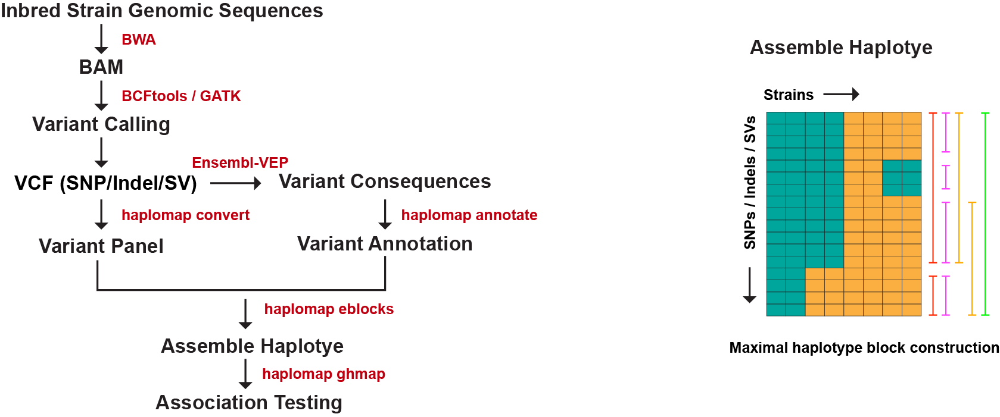

# Haplomap
Haplotype-based computational genetic mapping  



## Usage
### 0. Variant calling
See [variant calling](../workflows/README.md) using GATK, BCFtools, svtools.


### 1. Construct variant panel

**WARNING**: If you use GATK pipeline, you have to filter and subset SNP or Indel first. Haplomap `convert` work best with variants from BCFtools output. 

SNPs
```shell
build/bin/haplomap convert -o ${HOME}/data/SNPS/chr18.txt ${HOME}/data/VCFs/chr18.vcf

# support stdin, but much slower
zcat ${HOME}/data/VCFs/chr18.vcf.gz | bin/haplomap convert -o ${HOME}/data/SNPS/chr18.txt
```
Structural variants (You need to filter SVs first)
```shell
build/bin/haplomap convert -o ${HOME}/data/SNPS/chr18.sv.txt \
                           --type sv input.sv.vcf
```

### 2. Construct annotation file from ensemble-vep results
```shell
build/bin/haplomap annotate -o ${HOME}/data/SNPS/chr18.annotation.txt \
                            --type snp \
                            --samples test_strains.txt \ # only annotate the selected strains
                            input.vep.txt
```

(Optional) If you'd like to use `ANNOVAR` (contributed by Boyoung Yoo @byoo1), see this

- 1. generate strain level gene annotation database (only run once), see here: 
[scripts/gene_annotation](../scripts/gene_annotation/README.md)
    - this step generates 3 files for next step.
      - AA_by_strains_chr*.pkl 
      - mm10_kgXref.txt 
      - mm10_knownGene.txt

- 2. run `annotateSNPs.py` for each case (test_strains.txt) to get strain specific SNP annotation.
```shell
python scripts/annotateSNPs.py test_strains.txt chr18.txt \
                    AA_by_strains_chr18.pkl mm10_kgXref.txt mm10_knownGene.txt
                    genes_coding.txt genes_coding_transcript.txt
```
NOTE: Structural variants only support ensemble-vep inputs now !

### 3. Find haploblocks

```shell
build/bin/haplomap eblocks -a ${HOME}/data/SNPS/chr18.txt \
                     -g ${HOME}/data/chr18.annotation.txt \
                     -s ${HOME}/TMPDATA/test_strains.txt \
                     -o ${HOME}/TMPDATA/test.SNPs.hb.txt
```

### 4. Statistical testing with trait data

```shell
build/bin/haplomap ghmap -p ${HOME}/data/test_traits.txt \
                  -b ${HOME}/TMPDATA/test.SNPs.hb.txt \
                  -o ${HOME}/TMPDATA/test.final.output.txt
```
**NOTE 1**: 
By default. Output result are gene-summrized (see `haplomap ghmap --help`).   
Recommend adding `-a` flag, which will output gene-oriented format results.

**NOTE 2:** strain order in (-p) should keep the same to the (-b). That's, eblocks (-s)

## Input
see `example` folder for test cases.

### eblocks:
- Strain file (-s): 
  - Tree column txt file: "#Abbrev \t (Optional) \t Values "
  - see `test.strain.txt` in the example folder
- Allele file (-a): NIEHS compact format (use subcmd `convert` to convert vcf to niehs)
- Gene Annotation (-g): 
  - format: " <SNP_{chr}_{postion}>  <gene_name>  < consequence> "
  - see above to prepare this file

### ghmap:
- Trait file (-p):  
    - same as eblocks -s:  "#Abbrev \t (Optional) \t Values "
    - If multiple aninmal values for same strain, seperate them by comma. Example:
    ```$xslt
        129S1	18.2,19.1,14.3
        A_J	19.3,18.2
    ```
- haploblocks (-b): eblocks output file
- genetic distance matrix (-r): optional file, could obtain from plink.

**How to get the genetic distance matrix**

1. convert vcf to plink .tped, .tfam
```shell
haplomap convert  --plink \
                  -o ${HOME}/data/SNPS/chr1.snp.txt \
                  --type snp input.vcf
```

2. convert tped, tfam to .bed, .bim, .fam
```
plink --tfile chr1.snp --make-bed --out chr1
```
3. merge .bed files
```shell
plink --bfile chr1 --merge-list mergelist.txt --make-bed --out mouse_merged
```

note: the mergelist.txt in this format
  ```
  chr2.bed chr2.bim chr2.fam
  chr3.bed chr3.bim chr3.fam
  ...
  ```

4. Sample-distance and similarity matrices
```shell
plink --bfile mouse_merged # need .bim, .fam
      --make-rel square \ # Relationship/covariance
      --out mouse_grm \
      --threads 12
```
5. format to (ghmap -r) input
```shell
cut -f2 mouse_grm.rel.id | tr "\n" "\t" > mouse_grm.dist
echo "#$(cat mouse_grm.dist)" > mouse_grm.dist
cat mouse_grm.rel >> mouse_grm.dist
```


## Output

1. eblocks:

- SNP file (-p):

| NO | Field | Explanation |
|--- | ---- | ------------ |
|0 |Chrom | chromosome      |
|1 |Position | chromosome position (1-based) | 
|2 |SNP | SNP name |
|3 |Pattern | Binary pattern of alleles, strain order is same to the input strain file |
|4 |GeneName| Associated Gene   |
|5 |CodonFlag | Annotation |

- Haploblock file (-o):

| NO | Field | Explanation |
|--- | ---- | ------------ |
|0 |Chrom | chromosome idx      |
|1 |BlockIdx | Block id            |
|2 |BlockStart | SNP vector start index; row index (0-based) of eblock -p output |
|3 |Size  | SNP number of the HaploBlock |
|4 |ChrBeg| Chromosome begin position (1-based) |
|5 |ChrEnd| Chromosome end position  |
|6 |Pattern | Haplotype pattern, strain order is same to the input strain file |
|7 |GeneName| Associated Gene   |
|8 |CodonFlag | Annotation |


2. ghmap:
  * gene-oriented results file

| NO |Field | Explanation |
|---| ---- | ------------ |
|0 |GeneName     | Associated Gene     |
|1 |CodonFlag    | -1: non-coding; 0: synonymouse; 1: missense; 2: splicing  |             |
|2 |Haplotype    | Haplotype pattern, see header line for strain order   |
|3 |FStat/Pvalue | isCategorical ? Fstat : Pvalue |
|4 |EffectSize   | Genetic Effect ( Omega^2 )   |
|5 |FDR          | Benjamini Hochberg. If categorical, skip |
|6 |popPvalue    | Pillai’s Trace Pvalue |
|7 |popFDR       | Pillai’s Trace FDR |
|8 |Chr          | Chromosome      |
|9 |ChrStart     | Chromosome begin position (1-based) |
|10 |ChrEnd      | Chromosome end position   |
|11 | BlockIdx   | HaploBlock's index; the second column of eblock -o output |
|12 | BlockStart | SNPVector's index; row index (0-based) of eblock -p output |
|13 | BlockSize  | SNP number of HaploBlock |
|14 | Expression  | Gene expression Map, see header line  |

  * block-oriented result file

BlockIdx | BlockStart | blockSize | ChrIdx | ChrStart | ChrEnd | Pattern | Fstat/Pval | Effect | FDR | GeneExpMap | Gene | CodonFlag | ...


**CodonFlag**

i. SNPs
  * -1: Non-codon change
  * 0: Synonymous (not important)
  * 1: missense/nonsense
  * 2: Splicing site change
  * 3: Stop codon

ii. Indels and structral variants: 
  * 2: HIGH
  * 1: MODERATE
  * 0: LOW
  * -1: MODIFIER

See explanation [here](https://uswest.ensembl.org/info/genome/variation/prediction/predicted_data.html) 

